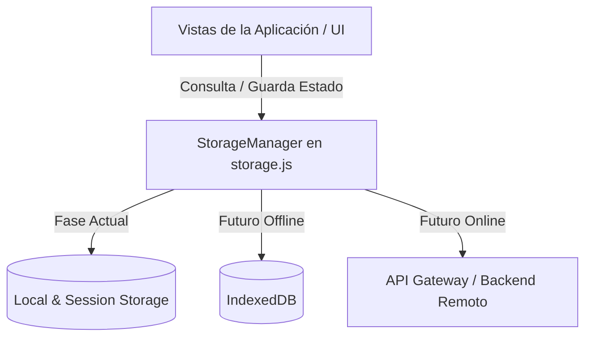

# Arquitectura del Contenido de Aprendizaje - POCUS Cardíaco

Este documento detalla la estructura y el diseño arquitectónico propuesto para incorporar características educativas (multimedia, cuestionarios, casos interactivos, progreso del estudiante y analíticas) en futuras fases de desarrollo.

---

## 1. Objetivo de la Arquitectura

El objetivo principal es establecer bases estructuradas, desacopladas y extensibles para la enseñanza interactiva de ultrasonografía dirigida (POCUS) en adultos. Se busca una arquitectura flexible que inicialmente funcione al 100% sin conexión a través de almacenamiento local en el navegador y que en el futuro admita la sincronización asíncrona con un backend centralizado sin requerir la refactorización de las interfaces de usuario (vistas).

---

## 2. Separación de Responsabilidades

Para mantener la mantenibilidad del proyecto, se establece una división estricta de las siguientes capas:

- **Contenido Clínico**: Datos descriptivos esenciales de mediciones, ventanas, abreviaturas y protocolos médicos (actualmente en `data/*.json`).
- **Contenido Multimedia**: Referencias y metadatos de imágenes, videoclips y diagramas educativos.
- **Cuestionarios**: Bancos de preguntas teóricas y evaluaciones rápidas asociadas a ventanas y mediciones.
- **Casos Educativos**: Escenarios clínicos interactivos progresivos estructurados por etapas lógicas de revelación.
- **Preferencias**: Preferencias visuales y de usabilidad del usuario (ej. tema claro/oscuro, idioma).
- **Progreso**: Historial detallado de cuestionarios resueltos, puntuaciones, pasos completados en protocolos y estado de avance en casos clínicos.
- **Analítica**: Registro ético de eventos pedagógicos e interacción técnica con la aplicación.
- **Identidad Futura**: Sistema abstracto de usuarios que asocia preferencias, progreso y consentimiento a un identificador único (UID).

---

## 3. Arquitectura Multimedia (`media-resources.json`)

Se propone estructurar las referencias multimedia en un archivo dedicado `data/media-resources.json` usando el siguiente esquema conceptual genérico:

```json
[
  {
    "id": "string (identificador único estable)",
    "type": "string (tipo de recurso: image | video | animation | diagram | audio)",
    "sources": {
      "format_webp": "string (ruta del recurso en formato WebP para imágenes)",
      "format_avif": "string (ruta del recurso en formato AVIF para imágenes)",
      "format_webm": "string (ruta del recurso en formato WebM para videos)",
      "format_mp4": "string (ruta del recurso en formato MP4 como fallback para videos)",
      "format_svg": "string (ruta del recurso en formato SVG para diagramas vectoriales)"
    },
    "poster": "string (ruta de la imagen poster/portada para videos)",
    "thumbnail": "string (ruta de la miniatura para previsualizaciones)",
    "title": {
      "es": "string (título en español)",
      "en": "string (título en inglés)",
      "pt": "string (título en portugués)"
    },
    "alt_text": {
      "es": "string (texto alternativo de accesibilidad)",
      "en": "string (texto alternativo de accesibilidad)"
    },
    "caption": {
      "es": "string (descripción a pie de foto/video)",
      "en": "string (descripción a pie de foto/video)"
    },
    "transcript": {
      "es": "string (transcripción textual completa)",
      "en": "string (transcripción textual completa)"
    },
    "subtitles": {
      "es": "string (ruta al archivo WebVTT de subtítulos)",
      "en": "string (ruta al archivo WebVTT de subtítulos)"
    },
    "duration_seconds": "number (duración para recursos de audio o video)",
    "author": "string (creador o autor del recurso)",
    "source": "string (institución u origen del material)",
    "license": "string (licencia Creative Commons o derechos aplicables)",
    "attribution": "string (texto de atribución obligatorio)",
    "linked_protocol_ids": ["array de strings (IDs de protocolos relacionados)"],
    "linked_component_ids": ["array de strings (IDs de componentes del protocolo)"],
    "linked_window_ids": ["array de strings (IDs de ventanas asociadas)"],
    "linked_measurement_ids": ["array de strings (IDs de mediciones asociadas)"],
    "tags": ["array de strings (etiquetas técnicas)"],
    "offline_policy": "string (essential | cache_on_first_use | optional_download | online_only)",
    "review_status": "string (draft | under_review | approved)"
  }
]
```

### Políticas Offline para Multimedia
Para evitar colapsar el almacenamiento local y optimizar la instalación inicial de la PWA, los recursos se clasifican según su importancia:
- `essential`: El recurso es crítico para la interfaz y se descarga en el precaché inicial de la PWA.
- `cache_on_first_use`: Se descarga de la red la primera vez que el usuario lo visualiza y se almacena en el caché dinámico para uso offline futuro.
- `optional_download`: Se le presenta un botón al usuario para permitir la descarga voluntaria del recurso (ideal para videos grandes o galerías completas).
- `online_only`: Solo está disponible si existe conexión activa de red (no se guarda en caché local).

> [!IMPORTANT]
> **Videos grandes y almacenamiento**: Los archivos de video de gran tamaño (resoluciones mayores a 480p, duraciones largas) nunca deben formar parte del precaché obligatorio del Service Worker (`ASSETS_TO_CACHE`). Esto garantiza descargas iniciales rápidas de la PWA.

---

## 4. Arquitectura de Cuestionarios (`quizzes.json`)

Las evaluaciones formativas se estructuran conceptualmente en `data/quizzes.json` con soporte para múltiples formatos interactivos:

```json
[
  {
    "id": "string (ID único)",
    "title": {
      "es": "string",
      "en": "string"
    },
    "description": {
      "es": "string",
      "en": "string"
    },
    "linked_protocol_ids": ["string"],
    "linked_window_ids": ["string"],
    "linked_measurement_ids": ["string"],
    "difficulty": "string (beginner | intermediate | advanced)",
    "estimated_minutes": "number",
    "passing_score": "number (porcentaje mínimo de aprobación, ej: 80)",
    "randomize_questions": "boolean",
    "review_status": "string",
    "questions": [
      {
        "id": "string (ID de pregunta único)",
        "type": "string (single_choice | multiple_choice | true_false | matching | ordering | numeric | image_identification | progressive_case)",
        "prompt": {
          "es": "string (enunciado de la pregunta)",
          "en": "string"
        },
        "options": {
          "es": ["array de strings (opciones disponibles)"],
          "en": ["array de strings"]
        },
        "correct_answer": "any (índice, array de índices, valor exacto o mapeo según el tipo)",
        "accepted_answers": ["array de valores aceptados para respuestas numéricas o de texto"],
        "explanation": {
          "es": "string (retroalimentación detallada tras responder)",
          "en": "string"
        },
        "references": ["array de strings (evidencia científica bibliográfica)"],
        "media_resource_ids": ["array de strings (recursos multimedia necesarios para la pregunta)"],
        "points": "number (puntos otorgados por responder correctamente)",
        "tags": ["array de strings"]
      }
    ]
  }
]
```

---

## 5. Arquitectura de Casos Interactivos (`learning-cases.json`)

Para casos de estudio que requieren la toma de decisiones por etapas con revelación progresiva de información, se diseña un esquema independiente en `data/learning-cases.json`. Esto permite desacoplar los casos clínicos complejos de los cuestionarios tradicionales directos.

### Esquema Conceptual
```json
[
  {
    "id": "string (ID único)",
    "title": {
      "es": "string",
      "en": "string"
    },
    "stages": [
      {
        "stage_index": "number (orden secuencial de la etapa)",
        "narrative": {
          "es": "string (descripción del estado actual del escenario)",
          "en": "string"
        },
        "vital_signs": {
          "heart_rate": "number | null",
          "blood_pressure": "string | null",
          "respiratory_rate": "number | null",
          "oxygen_saturation": "string | null",
          "temperature": "string | null"
        },
        "media_resource_ids": ["array de strings (recursos ecográficos asociados a esta fase del caso)"],
        "question": {
          "prompt": {
            "es": "string (pregunta crítica de toma de decisiones)",
            "en": "string"
          },
          "options": {
            "es": ["array de opciones / conductas a tomar"],
            "en": ["array de opciones"]
          },
          "correct_option_index": "number",
          "feedback_correct": {
            "es": "string (consecuencia positiva y justificación)",
            "en": "string"
          },
          "feedback_incorrect": {
            "es": "string (consecuencia de la decisión errónea y guía)",
            "en": "string"
          }
        },
        "next_stage_map": {
          "correct": "number (índice de la siguiente etapa si acierta)",
          "incorrect": "number (índice de la etapa si se equivoca, permitiendo ramificaciones)"
        }
      }
    ]
  }
]
```

---

## 6. Internacionalización (i18n)

Para garantizar la escalabilidad a tres o más idiomas (Español, Inglés, Portugués, etc.), se descarta el uso de llaves sueltas en la raíz (ej. `title_es`, `title_en`) y **se adopta un enfoque estructurado de objetos por idioma** en cada campo traducible:

```json
"title": {
  "es": "Eje Largo Paraesternal",
  "en": "Parasternal Long Axis",
  "pt": "Eixo Longo Paraesternal"
}
```

### Ventajas:
1. **Validación robusta**: Facilita la creación de esquemas JSON estrictos que comprueben la presencia obligatoria de los códigos de idioma.
2. **Acceso dinámico**: El enrutador y las vistas obtienen la cadena mediante un selector limpio: `item.title[currentLanguage] || item.title['es']`.
3. **Mantenibilidad**: Evita el crecimiento desordenado de propiedades a nivel raíz del objeto clínico.

---

## 7. Lineamientos de Accesibilidad (A11y)

Todos los desarrollos multimedia y cuestionarios futuros deben alinearse con las pautas de accesibilidad web (WCAG 2.1 AA):

- **Texto Alternativo (`alt_text`)**: Obligatorio en todas las imágenes del banco multimedia. Debe describir el hallazgo ultrasonográfico relevante, no solo nombrar el plano.
- **Subtítulos (`subtitles`)**: Los videos deben incorporar pistas de subtítulos nativos mediante archivos `.vtt` cargados con la etiqueta `<track>`.
- **Transcripciones (`transcript`)**: Los videos y archivos de audio contarán con transcripciones completas en texto para usuarios con discapacidades sensoriales.
- **Soporte de Teclado**: Los reproductores multimedia y botones de cuestionarios deben recibir foco claro por teclado (`tabindex`) y activarse con `Space` o `Enter`.
- **Controles Nativos**: Se priorizarán los controles nativos del navegador (`<video controls>`) frente a skins personalizados que comprometan la accesibilidad básica del navegador.
- **Reproducción Controlada**: Queda prohibido el inicio automático de videos (`autoplay`).
- **Seguridad visual**: Se evitarán destellos o cambios rápidos de iluminación en animaciones que puedan inducir crisis fotosensibles.

---

## 8. Privacidad y Seguridad

Al tratarse de una herramienta médica y educativa, la privacidad está garantizada desde la arquitectura básica:

- **Desidentificación Ultrasonográfica**: Todas las imágenes y videos clínicos provenientes de pacientes reales deben pasar por un proceso estricto de desidentificación antes de ser integrados al sistema, eliminando metadatos superpuestos como:
  - Nombre y apellido del paciente.
  - Número de expediente, cama o identificación médica.
  - Fecha exacta del estudio clínico.
  - Nombre del hospital, clínica o institución.
  - Logotipos del fabricante del equipo o identificadores del operador.
- **Eventos Analíticos Anonimizados**: Los eventos pedagógicos (`quiz_completed`, `media_opened`) solo transmitirán metadatos de rendimiento y rutas técnicas. Queda prohibida la inclusión de correos electrónicos, identificadores de sesión externos o datos de red que rompan la anonimización.
- **Políticas de Datos**: El consentimiento de analíticas se basará en un sistema de aceptación voluntaria (`opt-in`) que por defecto está inactivo (`false`). El usuario podrá exportar todo su historial o eliminarlo por completo desde el panel correspondiente.

---

## 9. Arquitectura de Almacenamiento y Sincronización Futura

La centralización de los estados de usuario en `storage.js` permite aislar el sistema de almacenamiento mediante una API unificada.



### Transición Transparente
Para migrar el almacenamiento local actual a un backend o a una base de datos local estructurada como `IndexedDB` en fases posteriores:
1. Las vistas de la interfaz invocan exclusivamente los métodos unificados de `Storage`.
2. Una futura migración implementará un adaptador en `storage.js` que resuelva las promesas de guardado o lectura interactuando con la red o con `IndexedDB`.
3. Ninguno de los componentes del frontend (`router.js`, `theme.js`, etc.) requerirá modificaciones, previniendo regresiones en la interfaz visual y la lógica clínica.
